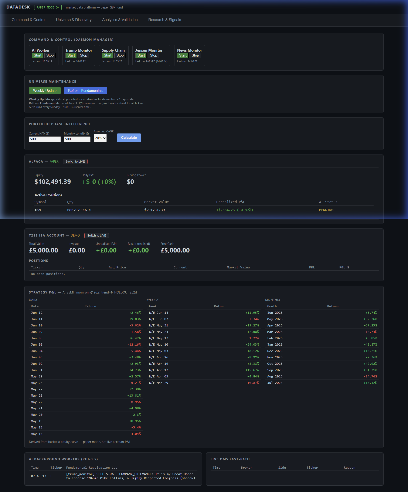
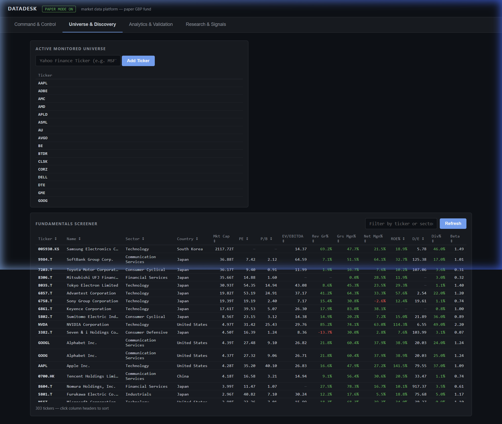
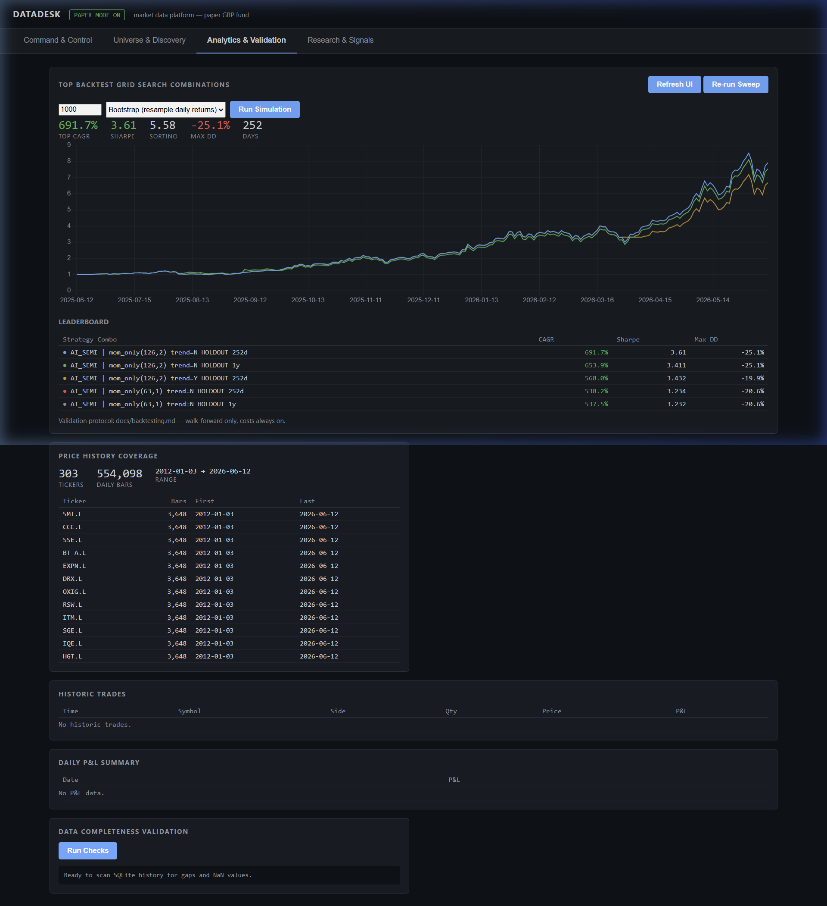
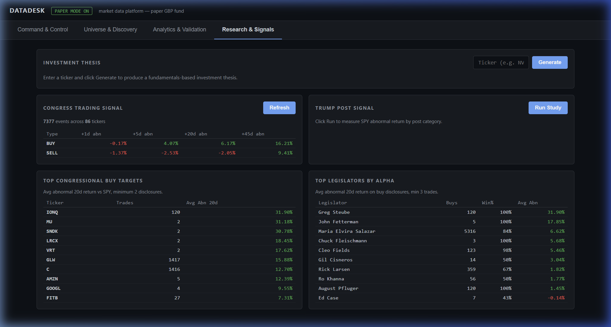

# DataDesk Platform UI Documentation

The **DataDesk** platform features a custom-built, modern, dark-themed Single Page Application (SPA). It uses a clean panel-based grid layout with high-contrast accent colors and a responsive tabbed navigation structure to manage the quantitative trading engine.

Here is a full video capture of navigating the platform:

---

## 1. Command & Control

This is the default dashboard view containing the mission-critical operational state of the platform.

### Key Features
- **Daemon Manager:** Allows manual start/stop controls for various background AI workers and monitors (e.g., Trump Monitor, Supply Chain, Jensen Monitor, News Monitor).
- **Universe Maintenance:** Controls for gap-filling price history and re-fetching fundamental data (PE, P/B, revenue, margins).
- **Portfolio Phase Intelligence:** A calculator predicting future NAV based on assumed CAGR and monthly contributions.
- **Account Integrations:** Direct hooks into Alpaca (Paper/Live modes showing Equity, Daily P&L, Buying Power, and Active Positions) and Trading 212 ISA Account.
- **Strategy P&L:** A read-out of daily, weekly, and monthly returns derived from the active backtest equity curve.

### Design & UX Analysis
> [!NOTE]
> **Strengths:** The dashboard effectively prioritizes high-level account health. The large, bold typography for Alpaca and T212 equity balances ensures critical numbers are readable at a glance.
> **Areas for Improvement:** The daemon manager relies on simple text labels ("Last run: Never"). Adding pulsing color indicators (green/red dots) for active daemons would improve situational awareness. Additionally, the Strategy P&L relies heavily on raw HTML tables; replacing these with mini sparkline charts would make the data significantly more digestible.

---

## 2. Universe & Discovery

This tab is dedicated to managing the active tracking universe and fundamentally screening equities.

### Key Features
- **Active Monitored Universe:** A command input to quickly add new Yahoo Finance tickers into tracking. Displays all currently monitored tickers.
- **Fundamentals Screener:** A dense, filterable table displaying real-time metrics for every tracked ticker, including Market Cap, PE ratio, Price-to-Book, EV/EBITDA, Gross/Net Margins, Return on Equity (ROE), Debt-to-Equity, Dividend Yield, and Beta.

### Design & UX Analysis
> [!NOTE]
> **Strengths:** The use of monospaced fonts (`Consolas`) for the fundamentals table is an excellent, professional choice that guarantees decimal alignment and gives the app a "quant terminal" feel. The data density is high, avoiding unnecessary whitespace.
> **Areas for Improvement:** As the universe grows, the table could become overwhelming. Introducing visual aids like inline bar charts, sparklines, or heat-map style conditional formatting (e.g., shading deep value PE ratios in green) would drastically speed up visual scanning and anomaly detection.

---

## 3. Analytics & Validation

The core backtesting analytics and verification engine interface.

### Key Features
- **Top Backtest Grid Search Combinations:** Controls to trigger global engine sweeps and Monte Carlo simulations.
- **Out-of-Sample Results:** Displays high-level KPIs for the best performing strategy (Top CAGR, Sharpe Ratio, Sortino Ratio, and Max Drawdown).
- **Leaderboard:** A heavily detailed table ranking all backtest combinations (e.g. `AI_SEMI | mom_only(126,2) trend=N`) by their out-of-sample CAGR and risk-adjusted metrics, complete with exact strategy parameters.

### Design & UX Analysis
> [!NOTE]
> **Strengths:** The hierarchical layout—placing the summary KPIs of the winning strategy at the top before the granular leaderboard—is structurally sound. It immediately answers "what is the best result?" before asking the user to analyze the data.
> **Areas for Improvement:** The leaderboard table currently lacks interactive elements. Implementing client-side sorting and filtering (e.g., clicking the 'Sharpe' header to sort) would turn this from a static report into a powerful analytical tool.

---

## 4. Research & Signals

This tab surfaces the outputs of the custom alternative-data monitors and signal generators.

### Key Features
- **Investment Thesis Generator:** Deep-dive fundamental research generation.
- **Congress Trading Signal:** Summarizes abnormal return alpha from 7,377 scraped congressional trades. It features:
  - **Top Congressional Buy Targets:** Highlighting the specific tickers bought by congress members and the associated alpha.
  - **Top Legislators by Alpha:** Ranking individual legislators by the performance of their tracked trades.
- **Trump Post Signal:** A module tracking the S&P 500 (SPY) abnormal returns surrounding posts.

### Design & UX Analysis
> [!NOTE]
> **Strengths:** Aggregating diverse, disparate alternative datasets (AI text generation, API scraping, social media sentiment) into unified, standardized visual modules is a major success of this tab. It makes highly complex alternative data accessible.
> **Areas for Improvement:** The signals are currently presented as text-heavy summaries. Integrating overlay charts—for example, plotting the exact timestamp of a Congressional trade directly on the asset's price chart—would provide a massive upgrade in visual context and conviction.
